# pfsense-ntp-gps
pfSense NTP GPS Server

SUMMARY

* pfSense NTP GPS Stratum 1 Server

PREREQUISITES

* Mini PC with DE9 RS232 port with DCD input or a RJ45 COM port with the CTS input
* Serial GPS receiver with PPS output

RECOMENDED HARDWARE

GPS RECEIVER 
* [Used Garmin GPS 16x LVS](https://www.ebay.com/sch/i.html?_from=R40&_nkw=Garmin+GPS+16x+LVS)
* [Used Garmin GPS 18x LVC](https://www.ebay.com/sch/i.html?_from=R40&_nkw=Garmin+GPS+18x+LVC)
* [Used Garmin GPS 19x HVS](https://www.ebay.com/sch/i.html?_from=R40&_nkw=Garmin+GPS+19x+HVS)

DE9 RS232 (DCD) MINI PC
* [Used Qotom Q305P/Q310P](https://www.ebay.com/sch/i.html?_from=R40&_nkw=qotom)

RJ45 COM (CTS) MINI PC
* [New/Used Protectli Vault FW Series](https://protectli.com/product-comparison/)

COMPATIBILITY 

* [Garmin GPS 16x Firmware (>= 4.50)](https://www8.garmin.com/support/download_details.jsp?id=4061)
* [Garmin GPS 18x Firmware (>= 4.50)](https://www8.garmin.com/support/download_details.jsp?id=4055)
* [Garmin GPS 19x Firmware (>= 2.80)](https://www8.garmin.com/support/download_details.jsp?id=6263)

* pfSense CE >= 2.6.0
* pfSense+ >= 23.01

INITIAL NTP CONFIG

1. Configure pfSense NTP Time Servers: time.nist.gov, prefer, pool
2. NTP Graphs: Enable RRD graphs
3. Statistics Logging: reference clock, clock discipline
4. Allow NTP to run for 24 hours to allow adequate time for the clock drift (a.k.a. freq) to settle. You may have to repeat this step after updating and/or reinstalling pfSense/FreeBSD

PPS ON CTS PIN

1. [FreeBSD UART Manual Page](https://man.freebsd.org/cgi/man.cgi?query=uart)
2. Disable Console Redirection in the BIOS and System -> Advanced -> Admin Access -> Serial Communication
3. CTS tunable example:
	* System -> Advanced -> System Tunables -> New
	* Tunable Name -> dev.uart.0.pps_mode
	* Description -> 1=CTS, 2=DCD
	* Value -> 1
4. Or, CTS loader example:
	* Create a /boot/loader.conf.local file
	* dev.uart.0.pps_mode="1"

GARMIN GPS CONNECTIONS

1. Procure the following:
    * [DE9 to RJ45 Adapter](https://www.amazon.com/gp/product/B08JLWRFH6)
    * [USB-A Plug Kit](https://www.amazon.com/gp/product/B08ZKM1QR6) for USB power
    * [RJ45 Crimp Connectors](https://www.amazon.com/gp/product/B01K9Z4A2E?th=1)
    * [3 foot Cat5e Patch Cable](https://www.amazon.com/gp/product/B00KXDFNCY?th=1)
    * [RJ45 Coupler](https://www.amazon.com/gp/product/B01MU1M7XE) or [RJ45 Jack](https://www.amazon.com/gp/product/B09YT94RTQ)
    * [Soldering Iron Kit](https://www.amazon.com/gp/product/B098JD8HD3)
    * [RJ45 Crimper](https://www.amazon.com/gp/product/B093LP3SML)
    * [USB to RS232 Adapter](https://www.amazon.com/gp/product/B0759HSLP1) for Garmin GPS Windows program firmware updates

2. The Garmin 16x LVS already has a RJ45 connector from the factory.  Note: The remote ON/OFF pin #3 needs to be connected to RS232 or RJ45 ground pin #5.
3. The Garmin 18x LVC has a JST connector from the factory, which can be re-terminated with a RJ45 connector with a similar pinout as the 16x for interchangeability.  Note: There is 1x26 AWG black power ground wire, and 2x28 AWG black wires under the PVC jacket even though only one is terminated to the JST connector.  Per Garmin Tech Support, both 28 AWG black wires are connected internally to the GPS module, thus only one needs to be connected to RS232 or RJ45 ground pin #5.
4. The Garmin 17x HVS and 19x HVS have bare leads and requires unregulated 8-33 Vdc, thus you can power it from the same 12 Vdc power supply as the Mini PC. I terminated the GPS 19x cable to a surface mount Ethernet jack.
5. Build a cable to provide power, RS232 communication, and PPS signal.

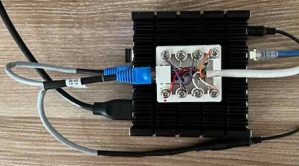

NTP SETTINGS 

* Services -> NTP -> Settings
* Enable NTP Server -> 1
* Interface -> LAN, Localhost
* Time Severs
	* time.nist.gov
	* Pool
* NTP Graphs-> Enable RRD graphs of NTP statistics -> 1
* Statistics Logging
	* Log reference clock statistics -> 1
	* Log clock discipline statistics -> 1
	* Log NTP peer statistics -> 1

NTP GPS SETTINGS EXAMPLE

* Services -> NTP -> Serial GPS
* Type -> Garmin
* Serial Port -> cuau0
* Baud -> 38400
* Check baud rate before sending init commands -> 1
* NMEA Messages -> All
* Fudge Time 1 -> 0.0013
* Fudge TIme 2 -> 0.369
* Minimum Poll Interval -> 3: 8 seconds
* Maximum Poll Interval -> 3: 8 seconds
* Prefer this clock -> 1
* Enable PPS signal processing -> 1
* Enable kernel PPS clock discipline -> 1
* Log the sub-second fraction of the received time stamp -> 1
* Display extended GPS status -> 1
* GPS Initialization 
	* $PGRMC,A,4,18,,,,,,,8,,2,4,*09 
	* $PGRMC1,1,1,,,,,,N,N,,,,1,,2*55 
	* $PGRMO,,2*75 
	* $PGRMO,GPGGA,1*20
	* $PGRMI,,,,,,,R*3F 
* Auto correct malformed initialization commands -> 1

USEFUL NTP CLI COMMANDS

* ntpq -pn
* ntpq -c kerninfo
* ntpq -c sysinfo
* ntptime

PFSENSE FIREWALL RULE

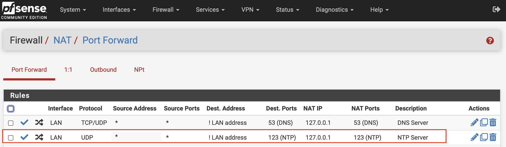

CLOCK OFFSET RESULTS

LCDPROC LCD DISPLAY (OPTIONAL)

1. You can optionally add a LCD display, install the LCDproc package, and enable the NTP status screen
	* Services -> LCDproc -> Screens -> Display NTP Status

SUGGESTED LCD DISPLAY

1. [Crystalfontz XES635 LCD USB Display in Steel Enclosure](https://www.crystalfontz.com/product/xes635bktfkku)
2. LCDproc server settings example:
	* Services -> LCDproc -> Server
	* COM port -> /dev/cuaU0
	* Display Size -> 4 rows 20 columns
	* Driver -> CrystalFontz Packet
	* Port Speed -> Default
	
LCDPROC NTP SCREEN NOTES

* I am by no means a NTPD algorithm expert, but I noticed if a source is marked as a valid PPS Peer "o", NTPD uses that to sync and serve time to clients regardless if there a separate Active Peer "\*" used for time data. If a GPS is being used for both a PPS Peer "o"and source of time data, it will be marked as PPS Peer "o" and there will be no other Active Peers "\*" marked. The NTP Widget seems to display the Active Peer "\*" even when the PPS Peer "o" is actually being used to sync and serve time to clients. Which source is actually served to clients can be confirmed with "ntpq -c sysinfo". If you want to see the stability value when using a GPS with PPS, you can simply set the Clock ID of the GPS source to "PPS". I intentionally did not include seconds on the display since even with the LCDProc Refresh Frequency set to 1 second, time will jump multiple seconds with each screen refresh. Not sure if there is another mechanism that would improve the refresh rate of the first row to eliminate increments of multiple seconds.

LCDPROC NTP SCREENS

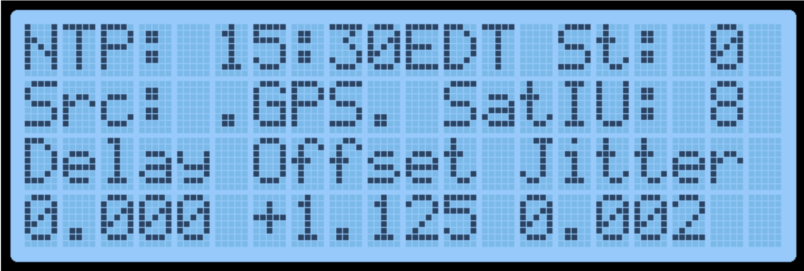
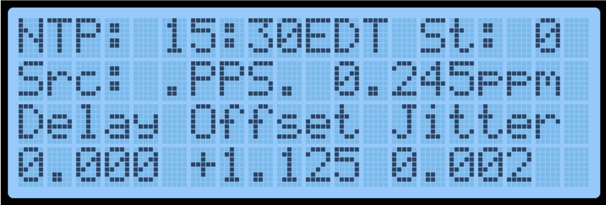
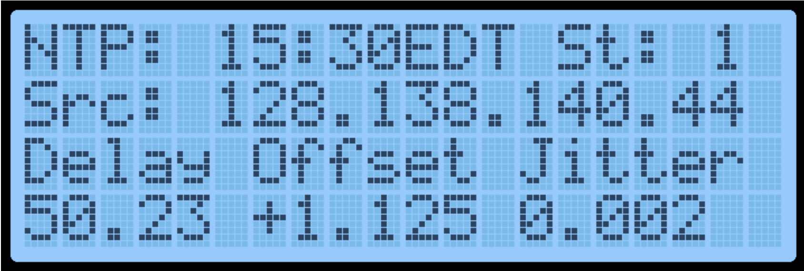

NTPPOOL ANALYSIS

1. If you add your NTP server to the NTPPOOL, you can analyze the data from the monitoring servers to assess your NTP server performance.
	* You can download the CVS log data from your monitoring page via the link at the bottom of the page.
	* Default will download 200 lines.  You can manually update the URL to include more lines if desired. 
	* Copy and paste the data into a ntp.txt file.
	* Use the ntp_analysis.py python script to perform analysis and generate the example plots below.
		* Note: The script was developed and tested on macOS.  You may have to install some python module dependancies. 
		* pip install pandas matplotlib seaborn scikit-learn

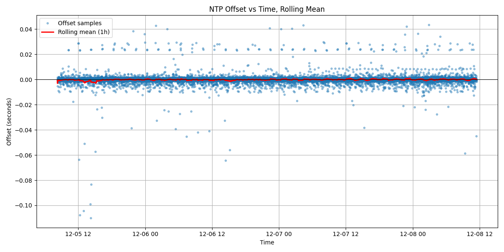
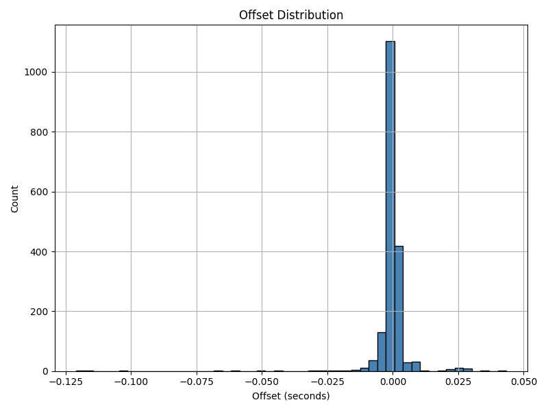
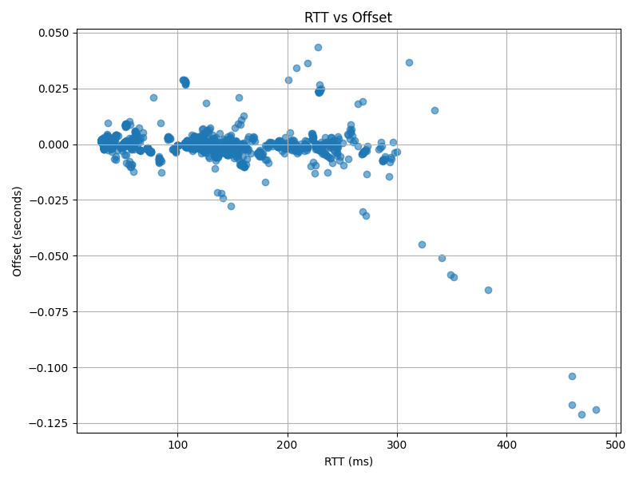
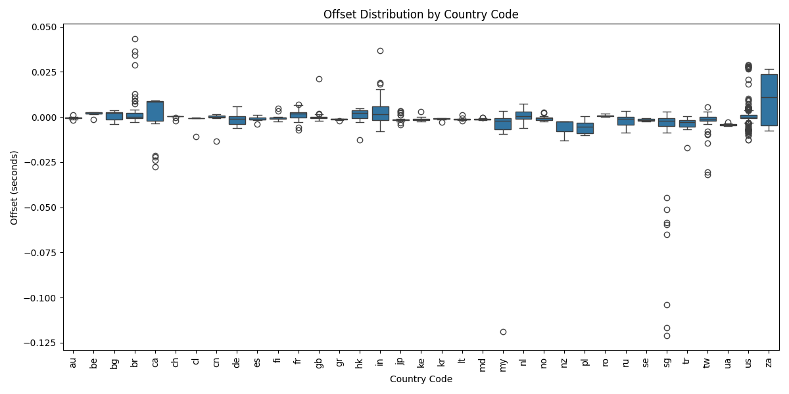
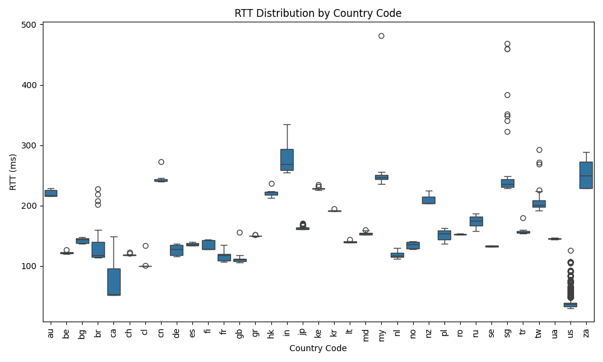
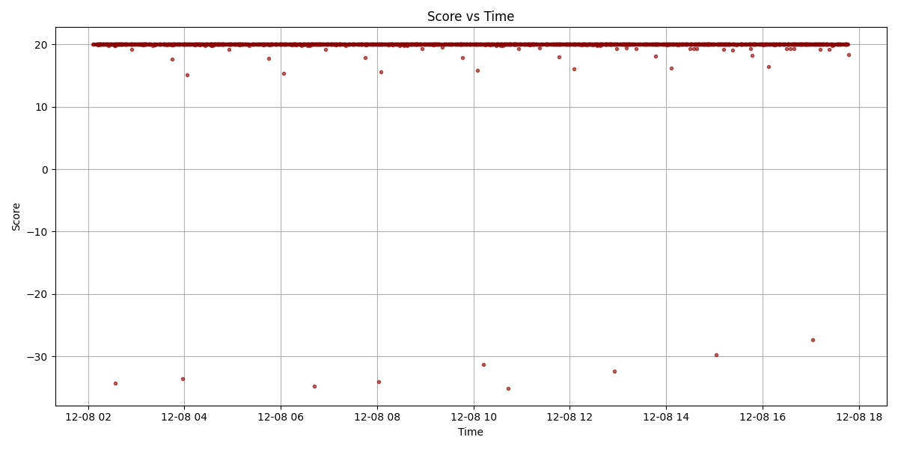

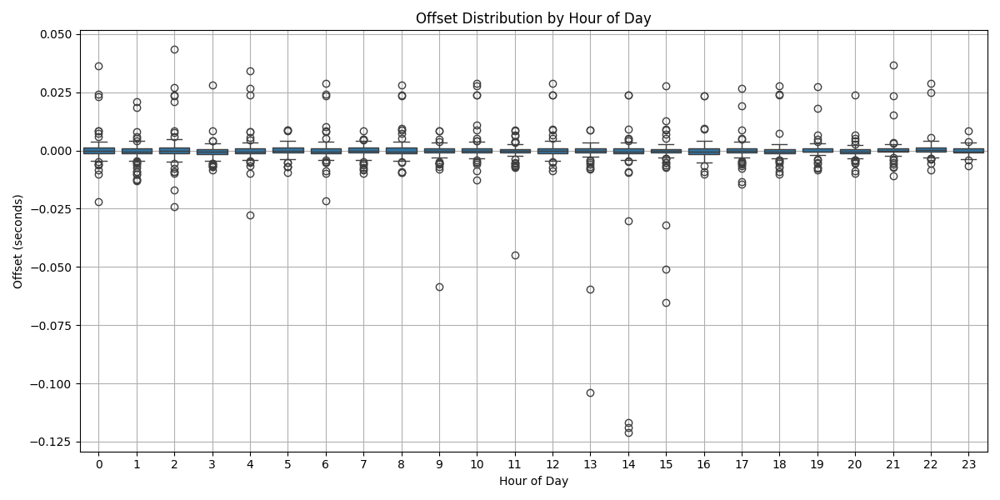
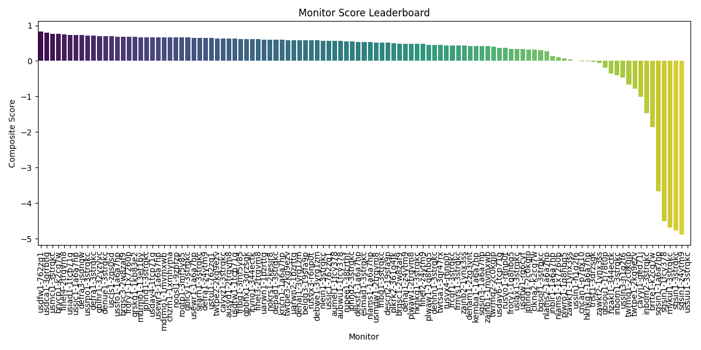
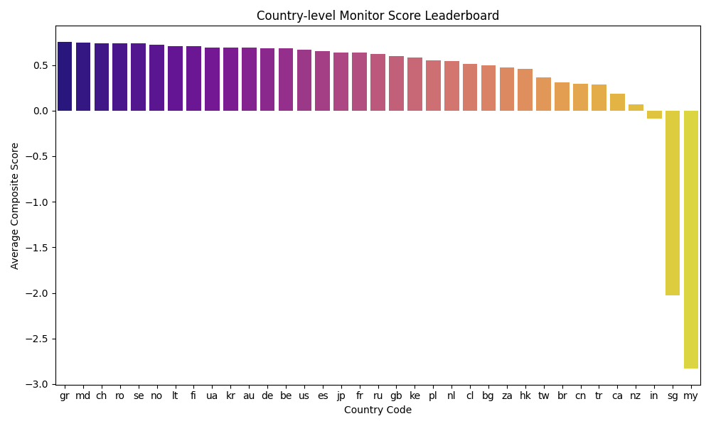
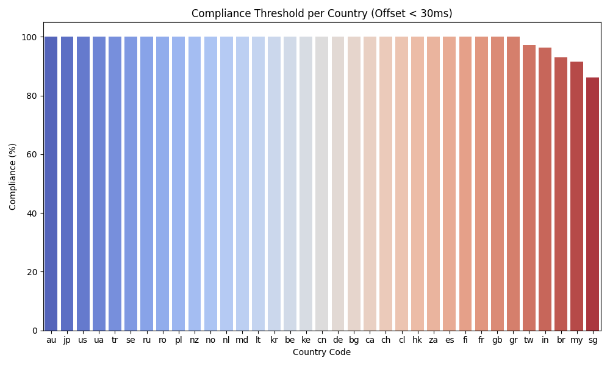
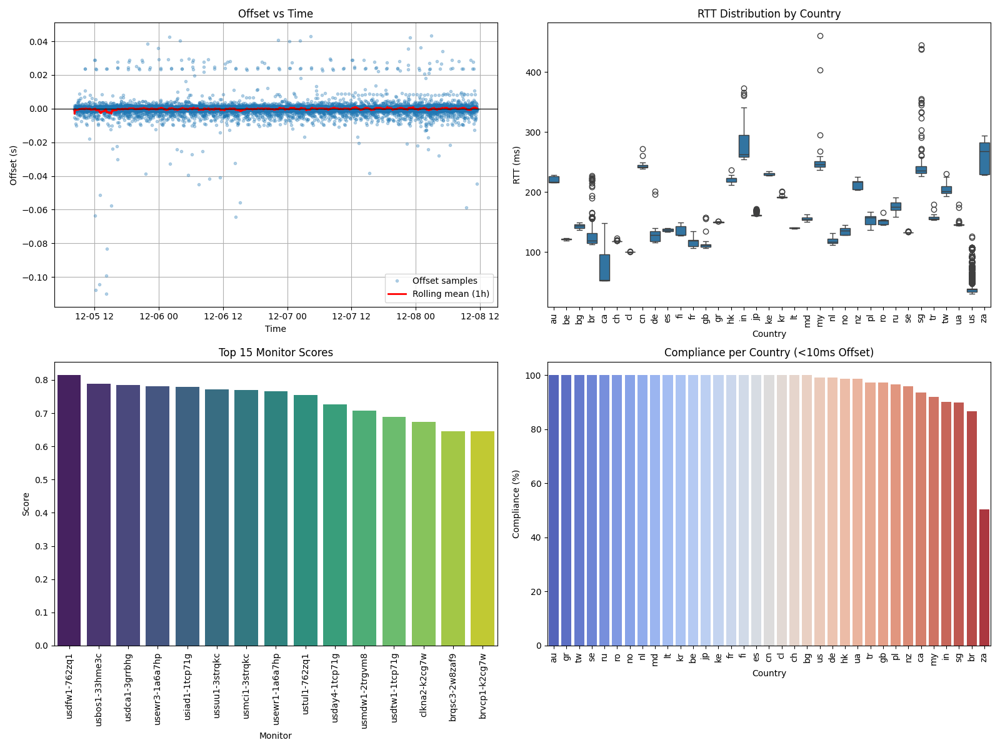

