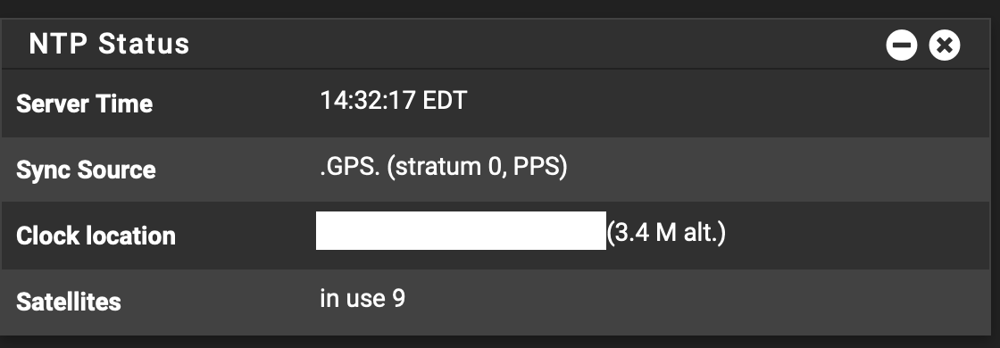

# pfsense-ntp-gps
pfSense NTP GPS Server

SUMMARY

* pfSense NTP GPS Stratum 1 Server

PREREQUISITES

* Mini PC with RS-232 port with DCD input
* Serial GPS receiver with PPS output

RECOMENDED HARDWARE
* [Used Qotom Q305P/Q310P](https://www.ebay.com/sch/i.html?_from=R40&_nkw=qotom)
* [Used Garmin GPS 16x LVS](https://www.ebay.com/sch/i.html?_from=R40&_nkw=Garmin+GPS+16x+LVS)
* [Used Garmin GPS 18x LVC](https://www.ebay.com/sch/i.html?_from=R40&_nkw=Garmin+GPS+18x+LVC)

COMPATIBILITY

* [Garmin GPS 16x Firmware (> 4.50)](https://www8.garmin.com/support/download_details.jsp?id=4061)
* [Garmin GPS 18x Firmware (> 4.50)](https://www8.garmin.com/support/download_details.jsp?id=4055)
* pfSenseCE 2.6.0
* pfSenseCE 2.7.0-DEVEL
* pfSense+ 23.01
* pfSense+ 23.05

INSTRUCTIONS

