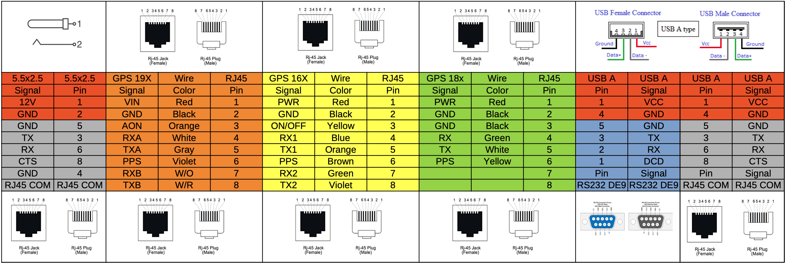
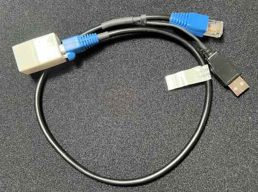

# pfsense-ntp-gps
pfSense NTP GPS Server

SUMMARY

* pfSense NTP GPS Stratum 1 Server

PREREQUISITES

* Mini PC with RS-232 port with DCD input
* Serial GPS receiver with PPS output

RECOMENDED HARDWARE
* [Used Qotom Q305P/Q310P](https://www.ebay.com/sch/i.html?_from=R40&_nkw=qotom)
* [Used Garmin GPS 16x LVS](https://www.ebay.com/sch/i.html?_from=R40&_nkw=Garmin+GPS+16x+LVS)
* [Used Garmin GPS 18x LVC](https://www.ebay.com/sch/i.html?_from=R40&_nkw=Garmin+GPS+18x+LVC)

COMPATIBILITY

* [Garmin GPS 16x Firmware (>= 4.50)](https://www8.garmin.com/support/download_details.jsp?id=4061)
* [Garmin GPS 18x Firmware (>= 4.50)](https://www8.garmin.com/support/download_details.jsp?id=4055)
* pfSenseCE 2.6.0
* pfSenseCE 2.7.0-DEVEL
* pfSense+ 23.01
* pfSense+ 23.05

NTP CONFIG

1. Configure pfSense NTP Time Servers: time.nist.gov, prefer, pool
2. NTP Graphs: Enable RRD graphs
3. Statistics Logging: reference clock, clock discipline
4. Allow NTP to run for 24 hours to allow adequate time for the clock drift (a.k.a. freq) to settle. You may have to repeat this step after updating and/or reinstalling pfSense/FreeBSD

GARMIN GPS CONNECTIONS

1. Procure the following:
    * [DE9 to RJ45 Adapter](https://www.amazon.com/gp/product/B08JLWRFH6)
    * [USB-A Plug Kit](https://www.amazon.com/gp/product/B08ZKM1QR6) for USB power
    * [RJ45 Crimp Connectors](https://www.amazon.com/gp/product/B01K9Z4A2E?th=1)
    * [3 foot Cat5e Patch Cable](https://www.amazon.com/gp/product/B00KXDFNCY?th=1)
    * [RJ45 Coupler](https://www.amazon.com/gp/product/B01MU1M7XE) or [RJ45 Jack](https://www.amazon.com/gp/product/B09YT94RTQ)
    * [Soldering Iron Kit](https://www.amazon.com/gp/product/B098JD8HD3)
    * [RJ45 Crimper](https://www.amazon.com/gp/product/B093LP3SML)
    * [USB to RS232 Adapter](https://www.amazon.com/gp/product/B0759HSLP1) for Garmin GPS Windows program firmware updates

2. The Garmin 16x LVS already has a RJ45 connector from the factory.  Note: The remote ON/OFF pin #3 needs to be connected to RS-232 ground pin #5.
3. The Garmin 18x LVC has a JST connector from the factory, which can be re-terminated with a RJ45 connector with a similar pinout as the 16x for interchangeability.  Note: There is 1x26 AWG black wire power ground, and 2x28 AWG black wires under the PVC jacket even though only one is terminated to the JST connector.  Per Garmin Tech Support, both 28 AWG black wires are connected internally to the GPS module, thus only one needs to be connected to RS-232 ground pin #5.
4. Build a cable to provide USB power, RS-232 communication, and PPS signal.

